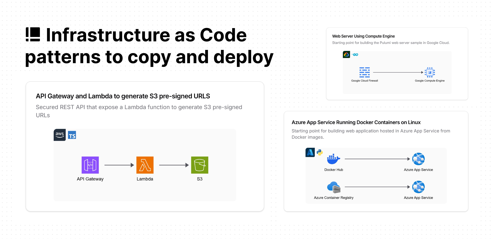

# Plotcode Library

Infrastructure as Code design patterns that you can copy and deploy.

# Frameworks

|  | &nbsp;AWS CDK | &nbsp;Pulumi |
| - | :-: | :-: |
| AWS | ✅ | 🛠️ |
| Azure | | ✅ |
| GCP | | ✅ |
| Oracle | | ✅ |

🛠️ AWS CDK patterns are being converted to Pulumi equivalents.

# Submit a pattern

AWS patterns are pulled from the [AWS Serverless Patterns](https://github.com/aws-samples/serverless-patterns) repo. To submit a pattern, please [create a pull request](https://github.com/aws-samples/serverless-patterns/blob/main/PUBLISHING.md) to the AWS repo.

Azure and GCP patterns are pulled from the [Pulumi Examples](https://github.com/pulumi/examples) repo. To submit a pattern, please [create a pull request](https://github.com/pulumi/examples/blob/master/CONTRIBUTING.md) to the Pulumi repo.

New patterns are be pulled from the AWS and Pulumi repos on each update of the Plotcode website.

For anything else, please refer to the [contributing guide](CONTRIBUTING.md).

# Community

Join on [Discord](https://discord.plotcode.com). Come say hi, ask a question or share your feedback.

# License

Licensed under the [MIT license](LICENSE).
